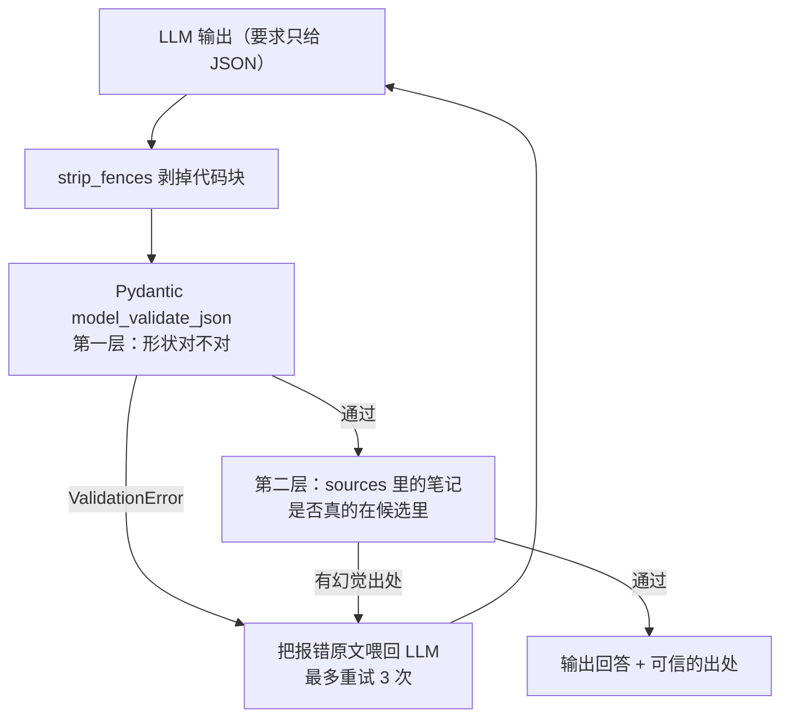

# v2 学习总结 · 结构化出处

> 对应 git tag：`v2` · 时间：2026-07
> 前情：v1 的「出处」只是 System Prompt 里的口头约定——模型在回答末尾写一句「出处：《xxx》」，写什么、写不写全凭自觉。

## TL;DR

**把出处从「Prompt 口头约定」升级为「schema 保证的结构化数据」**：定义 Pydantic 模型 → JSON Schema 进 Prompt → 校验模型输出 → 不合格把报错喂回去自纠。新增代码不到 60 行，但引入了 AI 应用最核心的工程范式：**LLM 的输出也是外部输入，必须过关卡，不能靠信任**。

## 1. 做出了什么

新增 `models.py`（8 行的 `Answer` 模型），`main.py` 的问答流程变成一个带自纠的验收循环：



实测：正常问题拿到 schema 保证的出处；「笔记里没写」的问题正确走 `sources: []` 空列表；至今全部第 1 次尝试就通过，重试循环是纯保险。

## 2. 第一次实战用上的 Python / Pydantic 知识

| 知识点 | 用在哪 | 要点 |
|--------|--------|------|
| `BaseModel` 继承 | `class Answer(BaseModel)` | 继承即获得一整套能力：构造校验、`model_validate_json`、`model_dump`、`model_json_schema` |
| `Field()` | 两个字段的配置 | 类型注解说「什么类型」，Field 装「其他一切」：默认值、约束、description |
| `default_factory=list` | sources 默认空列表 | 可变默认值陷阱的模型版——和函数默认参数是同一个坑，`default=[]` 会全实例共享 |
| `model_json_schema()` | 导出 schema 塞进 Prompt | schema 单一事实源：同一份声明喂模型、做校验、（v4）出文档 |
| `try/except ValidationError` | 第一层验收 | ≈ Zod 的 `safeParse`，异常对象的报错文本直接可用 |
| `re.sub` 剥代码块 | `strip_fences` | 模型爱包 ```json 围栏，解析前先剥 |

## 3. 第一次实战用上的 AI 知识

- **Structured Output 工作流**：Pydantic 模型 → JSON Schema → 进 Prompt → 校验回来的输出。`Field(description="...")` 是藏在 schema 里的 Prompt——模型是看着你的字段说明写答案的
- **报错信息是最好的修正 Prompt**：`ValidationError` 的原文直接喂回去，模型就知道怎么改——不需要自己写「修正指令」
- **双层验收**：schema 只保证「形状对」，保证不了「内容真」。出处是否真实存在，用普通代码检查——**能用规则校验的就不要靠 Prompt 祈祷**（v5 评估板块「规则兜底」的预演）
- **一个真实的取舍**：结构化和流式天然矛盾（JSON 要拿全才能校验），v2 放弃了 v1 的逐字流式。解法在 v4（服务端可以校验后再转发）

## 4. 关键区分：「参考笔记」≠「出处」

实测中一次提问喂了 5 篇候选笔记，模型只引用了 3 篇：

- `[参考笔记]` = 检索层**喂了什么**（候选，可能含噪音）
- `出处` = 模型声明**用了什么**（且每一项都被代码核对过真实存在）

这两个量的分离且各自可信，到 v5 会直接变成两个正式评估指标：检索命中率、引用忠实度。

## 5. 认知升级

- **LLM 输出是外部输入**：和用户表单、第三方 API 返回一样，进系统前必须过校验——这是把前端「不信任用户输入」的直觉平移到 AI 时代
- **好的约束让兜底闲着**：schema + description 写得清楚，3 次重试机制至今没触发过第 2 次——兜底机制的价值不在被触发，在于它存在
- **版本对比是最好的教材**：`git diff v1 v2` 一眼看清「口头约定 → schema 保证」改了哪些地方

## 6. 遗留与下一步

- [ ] 练习：给 `Answer` 加一个 `confidence: float`（0-1，`Field(ge=0, le=1)`）字段，体验 schema 演进——改一处，Prompt/校验/输出全跟着变
- [ ] 练习：openai 分支改用 `response_format` 的 json_schema 强约束，对比「Prompt 约束」和「API 级约束」的可靠性差异
- 持续：积累关键词检索翻车案例 → 开 **v3**（向量检索）
- 或者先做 **v4**（FastAPI 接口）——v3 和 v4 谁先都行，取决于哪个痛点先受不了
