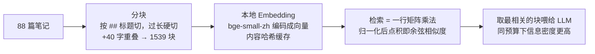

# v3 学习总结 · 向量检索

> 对应 git tag：`v3` · 时间：2026-08
> 前情：v1/v2 的检索靠数关键词，账本（检索翻车案例.md）攒下两起翻车后，我们确认了它的天花板不在实现层而在原理层——于是换范式。

## TL;DR

**把检索从「数字形」换成「比语义」**：本地跑 Embedding 模型（bge-small-zh，约 100MB，零 API 成本），把 88 篇笔记切成 1539 块、每块编码成向量，检索就是一次余弦相似度计算。账本复测：子串噪音全部消失，「字面零重叠」的同义问题首位命中。同时诚实记录了向量方案自己的新问题——天花板换了形状，没有消失。

## 1. 做出了什么

- `retrieval.py`：分块 → 编码 → 缓存 → 搜索，不到 120 行
- `compare.py`：拿翻车账本当验收测试集，关键词 vs 向量肩并肩对比
- 关键词方案保留作 baseline（`RETRIEVER=keyword` 切换）——它不是过时代码，是未来混合检索的另一条腿

## 2. 先回顾：老问题的总根源

v1/v2 挑笔记的原理：把问题拆成词，数每篇笔记里这些词出现多少次。这个思路有一个致命前提——**它假设「问问题用的词」和「笔记里写的词」是同一批词**。它不理解意思，只会数字。只要问法和写法用词不同，前提就崩了。后面所有翻车都是这个总根源的不同表现。

## 3. 解决了什么（前因后果）

### 问题一：问法和写法用词不同就找不到（同义鸿沟）

**前因**：问「怎么让程序同时干几件事」，词是「程序、同时、干、几件事」；笔记《4.03 并发编程》里写的是「并发、多线程、协程」。同一件事，用词零重叠，数词方案得零分。

**怎么解决**：Embedding 模型在海量文本上学会了「意思相近的话变成相近的数字」。「同时干几件事」和「并发编程」字面完全不同，向量却离得很近。检索只需算「问题的向量」和「每块笔记的向量」谁近。

**后果**：实测该问题向量首位命中《4.03 并发编程》；关键词方案首位是无关的《Vector Database》。这是 v3 最核心的胜利。

### 问题二：短英文词乱认亲戚（子串噪音）

**前因**：数词用「包含就算」的逻辑，`js` 在 `json`、`Next.js` 里都能找到自己，JS 目录的笔记集体白得分——账本案例 1 的翻车原因。

**怎么解决**：严格说是「绕过」——向量方案从头到尾不数字符，把整句话整体理解成一个意思，字符层面的误会无从发生。

**后果**：账本两案的噪音笔记全部消失。原计划的 `\b` 单词边界练习，被新范式连问题一起端走。

### 问题三：中文分词靠瞎猜（伪分词）

**前因**：中文没有空格，v1 用两字滑窗硬切，「装饰器是什么」切出「饰器」「是什」这类假词，靠 IDF 压噪是止痛不是治病。

**怎么解决**：也是绕过——模型直接吃整句，内部自己理解中文，外部切词环节整个消失。

### 问题四：长笔记的后半篇是检索盲区

**前因**：Embedding 模型一次最多读约 512 token（中文约一字一个）。笔记动辄几千字，整篇塞入只有开头被编码，**后半篇在检索世界里等于不存在**——《0.02 环境变量与配置》第 6 节的多环境配置就是这样被埋没的。

**怎么解决**：分块。按 `##` 标题切（顺着作者已经做好的语义分段），过长小节再硬切并留 40 字重叠（防止一句话被拦腰斩断后两边都查不到）。每块单独编码，笔记最深处的知识也有了自己的向量。

**附带收益**：喂给 LLM 的从「整篇（大半无关）」变成「相关的块」，同样的字数预算装进更多有效信息。

### 问题五（认知层）：AI 能力不一定要调 API

Embedding 模型下载到笔记本上本地运行：1539 块 5 秒编完，不要钱、不要网、不要 key。「模型也是一种可以拿在手里的软件」。

## 4. 还没解决什么（前因后果）

### 向量有自己的新型噪音

问 conda 磁盘混进《collections 高级容器》——模型判断的是「整体意思像不像」，不是「主题是否对口」。讲去重和容器复用的笔记，和「重复占磁盘」大方向上确实像，模型没错，但对我没用。**关键词输在字面同、意思异；向量弱在意思近、主题偏。** 解法：粗选后加精排（rerank），或混合检索。

### 精确匹配反而变弱了

向量把文字变成「大概的意思」，必然丢失精确字面。问「argparse 怎么用」「0.02 那篇讲了什么」，`argparse`、`0.02` 是需要一字不差匹配的记号——这恰是关键词最擅长、向量最迟钝的场景。工业界标准答案：**混合检索**（关键词管精确 + 向量管语义 + 融合排序）。

### 分块还很粗糙

硬切不认内容边界，可能把代码块、表格从中间劈开；380 字按字符数拍的，代码密集的块 token 可能超标被截尾。分块质量是 RAG 效果的第一瓶颈，这里还有很多可挖。

### 最重要：说不出「到底好了多少」

现在评价 v3 比 v1 好的依据是**肉眼看了 6 个问题的列表**。`MIN_SCORE=0.4`、块大小 380、取前 12 块——全是拍脑袋，而且没法调，因为**没有一个数字能告诉你调完是变好还是变坏**。解法是把账本扩成正式测试集（每题标注正确出处），自动跑检索命中率、答案忠实度——这就是 v5。**没有度量就没有优化。**

### 架构老问题原样躺着

只能在终端用（v4 服务化）、v2 牺牲的流式没恢复（v4）、模型只能被动接收检索结果而不能自己说「我想再翻翻别的笔记」（v6）。

## 5. 第一次实战用上的知识

| 知识点 | 用在哪 | 要点 |
|--------|--------|------|
| NumPy 矩阵运算 | `self.vectors @ q` | 归一化后点积 = 余弦相似度，一次乘法算完全部块 |
| 正则前瞻断言 `(?=## )` | 按标题分块 | 零宽断言：切点不吃掉标题，每块自带标题 |
| `hashlib.md5` 内容哈希 | Embedding 缓存 | 内容不变不重算——「同文本不重复算钱」 |
| 重依赖延迟 import | `SentenceTransformer` 放函数内 | torch 加载要几秒，不用就不付钱 |
| Embedding 原理 | 整个 retrieval.py | 语义 → 几何位置；query 侧加官方前缀（问题和文档是两种角色） |
| 分块工程 | `split_chunks` / `_wrap` | 顺作者结构切 + overlap 防切缝盲区 + 编码时拼笔记名补上下文 |

## 6. 认知升级

- **换范式 vs 修 bug**：`\b` 能修子串误报，但修不了「数字不懂意思」——识别「这是 bug 还是天花板」决定该打补丁还是换方案
- **天花板不消失，只换形状**：新方案解决旧问题的同时带来新问题，工程是权衡的迭代不是终点的抵达
- **baseline 不删**：旧方案是新方案的对照组和未来混合方案的组件
- **验收测试集来自真实翻车**：账本从「记录不爽」变成「验收标准」，这个闭环比任何教程习题都有说服力

## 7. 下一步

- **v4**：FastAPI 服务化（顺便恢复流式、手机可用）
- **v5**：把账本扩成正式评估集，给所有拍脑袋的参数一个可校准的依据
- 检索深水区（rerank、混合检索、更聪明的分块）：攒着，等评估就位后有数字指引再动手
